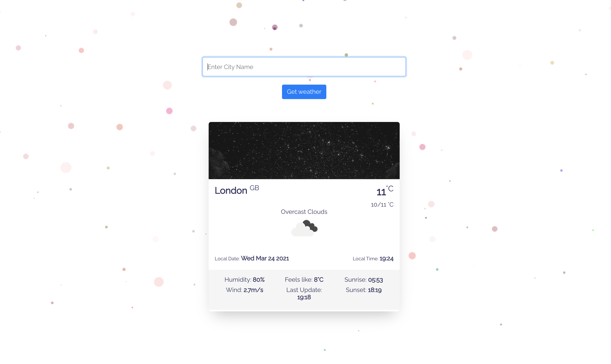

# Weather App

### Live Demo
[https://weatherblo.netlify.app](https://weatherblo.netlify.app/)

## Table of contents
* [General Info](#markdown-header-general-info)
* [Description](#markdown-header-description)
* [App Screenshot](#markdown-header-app-screenshot)
* [Technologies](#markdown-header-technologies)
* [Features](#markdown-header-features)

### General Info 
This project is a **ReactJS** powered application and was bootstrapped with Create React App.

### Description 
* This project is a Weather Web App which displays the weather forecast for user-specified locations.
+ This project is pubished on netlify.
+ VERSION: v 1.0

### App Screenshot

### Technologies 
Project is created using:

* Axios - for API calls
* Bootstrap
* React Hook Form
* Particles - for particles background
* Parallax Tilt - for tilt effect

### Features 
 * The project for now provides information such as:
 
- city and country
- local date and time
- min/max temperature
- sunrise and sunset etc.

### Future Additions
* Produce an hourly or weekly forecast

### Acknowledgement
* Open Weather API

### Who do I talk to? 
* Repo owner : `isaac.afrifa3@yahoo.com`

